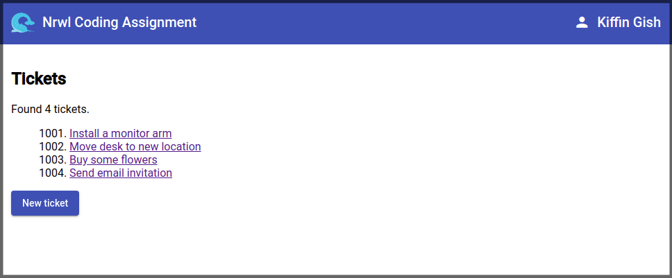

# Nrwl Coding Assignment



## Introduction

This is the code challenge I was given, see the [Coding Assignment](./src/README.md) for more details.

Build a ticket managing app, where the user can add, filter, assign, and complete tickets.

[Edit on StackBlitz ⚡️](https://stackblitz.com/edit/nrwl-coding-assignment-2018-paduqy)o

## Screens

There are three screens:

* Home (starting point)
* Tickets (list of all tickets, click ticket link to go to detail page)
* Ticket detail (view ticket, update or delete)

For styling I used [Angular Material](https://material.angular.io).

The [Angular router](https://angular.io/guide/router) manages transitions between the screens.

My preference is for [Lazy loading Feature Modules](https://angular.io/guide/lazy-loading-ngmodules) so I used this
where relevant.

It was suggested to use [NgRx](https://ngrx.io) for state management. However, due to time constraints I chose not to since this is such
a basic application that using state management would be a bit of an overkill.

## Code structure

Here is a high level view of the project.

```
.
├── app
│   ├── pages
│   │   ├── home
│   │   └── tickets
│   │       ├── create
│   │       └── detail
│   ├── services
│   │   └── backend.service.ts
│   └── shared
│       ├── footer
│       └── header
├── assets
└── assets
    └── images
        ├── favicon.png
        └── logo.svg

```

## Backend

The backend is a mock server api which uses in memory static data (tickets and users).

## Error handling

When making calls to the 

```
ngOnInit(): void {
    this.tickets$ = this.backend.tickets().pipe(
        catchError(err => this._handleError('tickets'))
    );
}

// Private

private _handleError(fn: string) {
    console.log(`backend.${fn}() failed`);
    return of([]);
}
```

## Code quality

### Linting

```
$ ng lint
```

## Testing

### Unit testing

```
$ ng test
```

### E2E testing

```
$ ng e2e
```

## Time spent

Focussing on the assignment instructions, I spent in total two evenings and part of a day. When nearing completion, I 
happened to look at the original email again and discovered that there was a time indication of 2.5 hours, oh dear.
Sorry about that.

## Author

```
Kiffin Gish
kiffin.gish@planet.nl
```
